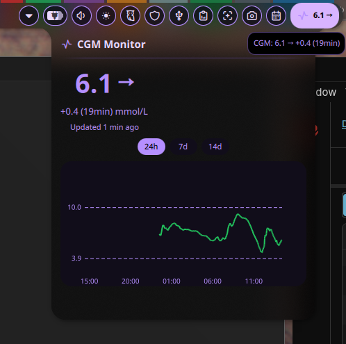

# LibreLink GCM

LibreLink is a sensor which periodically measures the persons glucosevalues. These values are transferred to a mobile app. From there on - the user might have setup 'LibreLinkUp' which synchronizes the values to a cloud solution. This plugin connects to LibreLinkUp and reads data from there.

## Description

This plugin is designed after the gnome-shell extension for LibreLinkUp. You enter your region in the settings page, along with credentials and other preferences.

The plugin then periodically reads measurements from LibreLinkUp (cloud) and stores them in a locally SQLite database. These data points are also visualized and any values above or below the predefined thresholds will trigger a warning.

## Requirements

For Debian based systems you need to have the `libsecret-tools` package installed. This is for storing and reading from the keyring.

```sh
sudo apt install libsecret-tools
```

## Screenshot


